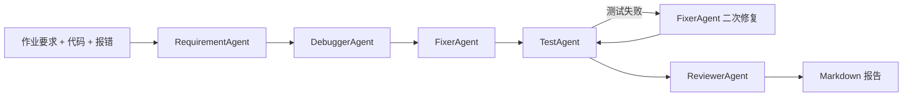

# CodeGuardian-Agent

CodeGuardian-Agent 是一个面向编程作业 Debug、自动测试、修复与提交检查的多 Agent 系统。用户输入作业要求、当前代码、报错信息、编程语言和是否允许本地运行测试后，系统会自动完成需求理解、错误定位、最小修复、测试生成、可选本地执行、提交前审查，并输出 Markdown 报告。

## 1. 项目简介

本项目使用 Python 构建，支持命令行 CLI 和 Streamlit Web UI 两种使用方式。核心能力由五个 Agent 协作完成：

- `RequirementAgent`：理解题目要求、函数签名、输入输出、限制条件和隐藏测试点。
- `DebuggerAgent`：分析代码和报错，定位语法、类型、参数、逻辑和边界问题。
- `FixerAgent`：优先做最小修改，生成修复后的完整代码。
- `TestAgent`：生成 3 到 5 个测试用例，并在允许时尝试本地运行 Python 或 C++ 测试。
- `ReviewerAgent`：检查可提交性，给出评分、风险和最终建议。

## 2. 核心痛点

编程作业常见问题包括错误定位不系统、修复过程容易改坏原结构、缺少边界测试、提交前没有自动检查。CodeGuardian 将 Debug 流程拆成多个专职 Agent，让每一步都有明确输出，并通过测试结果触发一次二次修复，形成反馈闭环。

## 3. 多 Agent 架构说明

系统入口是 `CodeGuardianOrchestrator`。它负责调度五个 Agent，并把每个阶段的结果串联起来。每个 Agent 都通过统一的 `LLMClient` 调用 OpenAI SDK，输出 Pydantic 定义的结构化结果，方便 CLI、Web UI 和报告生成复用。

## 4. 工作流图



流程体现：

- Requirement -> Debug -> Fix -> Test -> Refine -> Review
- 长链路推理
- 工具调用
- 测试反馈闭环

## 5. 安装方法

```bash
cd CodeGuardian-Agent
python -m venv .venv
.venv\Scripts\activate
pip install -r requirements.txt
```

macOS / Linux 激活虚拟环境：

```bash
source .venv/bin/activate
```

## 6. 环境变量配置

复制示例配置：

```bash
copy .env.example .env
```

macOS / Linux：

```bash
cp .env.example .env
```

然后在 `.env` 中填写：

```env
OPENAI_API_KEY="your_api_key_here"
OPENAI_MODEL="gpt-5.5"
# OPENAI_BASE_URL="https://api.openai.com/v1"
```

注意：

- 不要提交真实 API Key。
- 使用 `.env` 保存本地配置。
- `.env` 已经被 `.gitignore` 忽略。
- 如果使用自定义代理或兼容服务，可以设置 `OPENAI_BASE_URL`。

## 7. CLI 使用方法

```bash
python main.py analyze ^
  --assignment examples/assignment.txt ^
  --code examples/buggy_sum_even.cpp ^
  --error examples/error.txt ^
  --language C++ ^
  --run-tests
```

不运行本地测试：

```bash
python main.py analyze --assignment examples/assignment.txt --code examples/buggy_sum_even.cpp --language C++
```

自定义报告路径：

```bash
python main.py analyze --assignment examples/assignment.txt --code examples/buggy_sum_even.cpp --output outputs/report.md
```

## 8. Web UI 使用方法

```bash
streamlit run app.py
```

打开浏览器后，在页面中填写：

- 作业要求
- 当前代码
- 报错信息
- 编程语言
- 是否运行测试

点击“开始分析”后，页面会展示五个 Agent 的结构化结果、修复后的代码、测试结果、最终建议，并提供 Markdown 报告下载。

## 9. 示例运行

示例作业：

```text
实现一个函数 int sumEven(vector<int>& nums)，返回数组中所有偶数的和。空数组应返回 0。
```

示例命令：

```bash
python main.py analyze --assignment examples/assignment.txt --code examples/buggy_sum_even.cpp --error examples/error.txt --language C++
```

生成报告：

```text
outputs/report.md
```

## 10. 项目亮点

- 多 Agent 分工：每个 Agent 只负责一个清晰阶段。
- 结构化输出：所有核心结果都由 Pydantic 模型约束。
- 反馈闭环：测试失败后会触发一次二次修复。
- 双入口：支持 CLI 和 Streamlit Web UI。
- 本地工具：支持文件读取、Markdown 报告保存、Python / C++ 代码运行。
- 提交前检查：ReviewerAgent 会检查签名、输入输出、复杂度、风险和可提交性。

## 11. 后续优化方向

- 增加更严格的沙箱隔离。
- 支持 Java、JavaScript 等更多语言的本地测试。
- 让 TestAgent 输出更标准的可执行测试文件。
- 增加历史报告管理和对比。
- 支持把报告导出为 PDF。
- 增加离线规则引擎，降低简单题目对 LLM 的依赖。

## 12. GitHub 上传步骤

```bash
git init
git add .
git status
git commit -m "Initial CodeGuardian-Agent project"
git branch -M main
git remote add origin https://github.com/YOUR_USERNAME/CodeGuardian-Agent.git
git push -u origin main
```

上传前请确认：

```bash
git status
```

不要提交 `.env`。真实 API Key 只能保存在本地 `.env` 中，不能进入 GitHub。项目的 `.gitignore` 已经忽略 `.env`、`.venv/`、`__pycache__/`、`*.log` 和 `outputs/`。

## 13. 本地测试

本项目自带基础 pytest，用于测试文件读取和 prompt 构建，不会真实调用 API。

```bash
pytest
```

## 成果描述

我构建了一个面向编程作业和代码调试场景的多 Agent 自动化系统 CodeGuardian。项目主要解决编程作业中错误难定位、修复过程缺少系统化步骤、提交前缺少自动检查的问题。系统将任务拆解为 RequirementAgent、DebuggerAgent、FixerAgent、TestAgent、ReviewerAgent 五个角色，分别完成需求理解、错误定位、代码修复、测试生成与运行、提交前审查。

该系统具备长链路推理与反馈闭环能力，会先理解题目要求，再分析代码和报错，生成最小修改方案，并通过测试结果进行二次修复，最后输出可提交性建议和 Markdown 报告。相比单次问答式 Debug，该项目流程更稳定、可复用性更强，也更接近真实 AI Agent 工作流。
